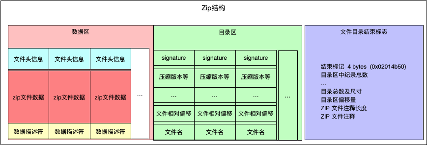
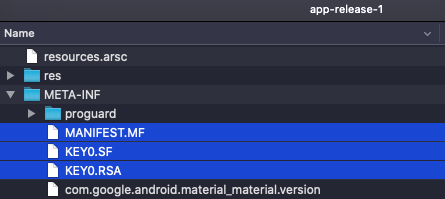
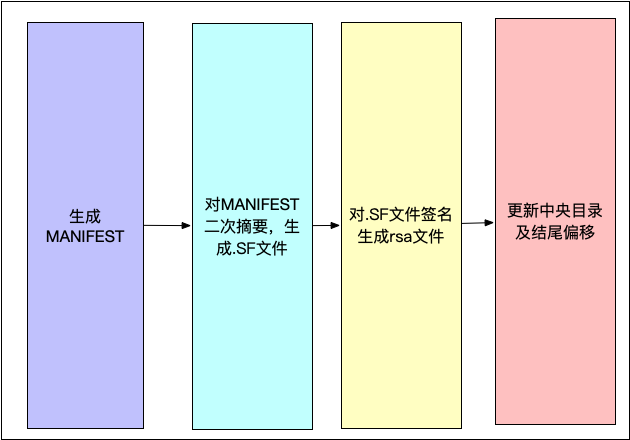
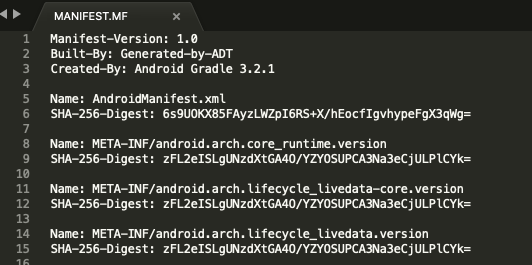
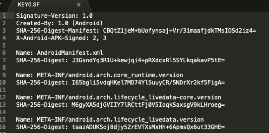
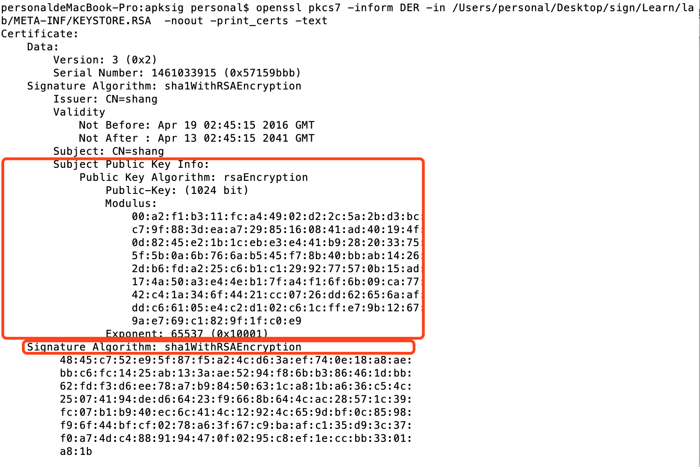
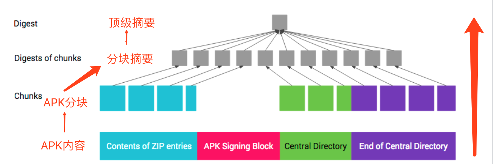

# apk签名过程分析
通过应用签名，开发者可以标识应用创作者并更新其应用。在 Android 上，应用签名是将应用放入其应用沙盒的第一步。已签名的应用证书定义了哪个用户 ID 与哪个应用相关联；不同的应用要以不同的用户 ID 运行。
## 1. 签名工具及源码-apksigner
工具：android-sdk/build-tools/*version*/apksigner <br>
使用方式：[https://developer.android.com/studio/command-line/apksigner](https://developer.android.com/studio/command-line/apksigner) <br>
源码：[https://android.googlesource.com/platform/tools/apksig/](https://android.googlesource.com/platform/tools/apksig/)

## 2. apk包格式规范
apk包拓展自zip包，遵从zip包的格式规范。<br>
apk包的格式如下：<br>
<br>
对应每块的详细结构：<br>


## 3. 签名流程
为了最大限度地提高兼容性，请按照 v1、v2、v3 的先后顺序采用所有方案对应用进行签名。与只通过 v1 方案签名的应用相比，还通过 v2+ 方案签名的应用能够更快速地安装到 Android 7.0 及更高版本的设备上。更低版本的 Android 平台会忽略 v2+ 签名，这就需要应用包含 v1 签名。

与只通过 v1 方案签名的应用相比，还通过 v2+ 方案签名的应用能够更快速地安装到 Android 7.0 及更高版本的设备上。

### 3.1 V1签名流程
在Android7.0 以下的系统上安装的应用必须使用V1签名方案进行签名。<br>
#### 3.1.1 V1签名设计的文件
V1签名方案体现在三个文件上：MENIFEST.MF, key-alias.SF, key-alias.RSA.<br>

<br>

三个文件的生成顺序：<br>



#### 3.1.2 V1签名如何保证信息完整性

1. MANIFEST.MF：摘要文件，存储文件名与文件的SHA1摘要（Base64格式）键值对，格式如下，其作用是保证每个文件的完整性。



2. CERT.SF：二次摘要文件，对MANIFEST.MF文件进行摘要计算，然后将MANIFEST.MF文件中每一个文件名对应的摘要再次计算摘要。格式如下：



3. CERT.RSA 证书（公钥）及签名文件，存储keystore的公钥、发行信息、以及使用私钥对CERT.SF文件的签名信息。

<br>

MENIFEST.MF和key-alias.SF两个文件保证apk文件的完整，key-alias.RSA文件通过私钥进行加密，保证了V1签名方案的安全(前两个文件和.RSA文件是同一个开发者的签名。)

### 3.2 V2签名流程

使用Android 7.0 及更高版本的系统支持 APK V2签名方案及更高版本的方案。

V2签名就不针对单个文件校验了，而是针对APK进行校验，将APK分成1M的块，对每个块计算值摘要，之后针对所有摘要进行摘要，再利用摘要进行签名。

V2摘要签名分两级，第一级是对APK文件的1、3 、4 部分进行摘要，第二级是对第一级的摘要集合进行摘要，然后利用秘钥进行签名。安装的时候，块摘要可以并行处理，这样可以提高校验速度。



## 4.源码分析

签名任务入口：ApkSigner类中的sign函数。

```

private void sign(
            DataSource inputApk,
            DataSink outputApkOut,
            DataSource outputApkIn)
            throws IOException, ApkFormatException, NoSuchAlgorithmException, InvalidKeyException, SignatureException {            

```


第一步，对apk文件按照zip文件的格式进行分析，将zip文件中的三块保存到inputZipSections变量中。若有V2或者V3签名块，则zip文件被分为四块。


```

// Step 1. Find input APK's main ZIP sections
        ApkUtils.ZipSections inputZipSections;
        try {
            inputZipSections = ApkUtils.findZipSections(inputApk);
        } catch (ZipFormatException e) {
            throw new ApkFormatException("Malformed APK: not a ZIP archive", e);
        }
        long inputApkSigningBlockOffset = -1;
        DataSource inputApkSigningBlock = null;
        try {
            ApkUtils.ApkSigningBlock apkSigningBlockInfo =
                    ApkUtils.findApkSigningBlock(inputApk, inputZipSections);
            inputApkSigningBlockOffset = apkSigningBlockInfo.getStartOffset();
            inputApkSigningBlock = apkSigningBlockInfo.getContents();
        } catch (ApkSigningBlockNotFoundException e) {
            // Input APK does not contain an APK Signing Block. That's OK. APKs are not required to
            // contain this block. It's only needed if the APK is signed using APK Signature Scheme
            // v2 and/or v3.
        }
        //签名后apk内的分块: 
        //1. Contents of ZIP entries; 
        //2. APK signing block; 
        //3. central directory; 
        //4. End of Central Directory"
        DataSource inputApkLfhSection =
                inputApk.slice(
                        0,
                        (inputApkSigningBlockOffset != -1)
                                ? inputApkSigningBlockOffset
                                : inputZipSections.getZipCentralDirectoryOffset());

```

第二步，解析Contents of ZIP entries中的文件，(从AndroidManifest.xml中)获得minSDKVersion，这个会影响签名算法的选择；然后创建签名引擎。

```

// Step 2. Parse the input APK's ZIP Central Directory
        ByteBuffer inputCd = getZipCentralDirectory(inputApk, inputZipSections);
        List<CentralDirectoryRecord> inputCdRecords =
                parseZipCentralDirectory(inputCd, inputZipSections);

        List<Hints.PatternWithRange> pinPatterns = extractPinPatterns(  
                inputCdRecords, inputApkLfhSection);
        List<Hints.ByteRange> pinByteRanges = pinPatterns == null ? null : new ArrayList<>();

        // Step 3. Obtain a signer engine instance
        ApkSignerEngine signerEngine;
        if (mSignerEngine != null) {
            // Use the provided signer engine
            signerEngine = mSignerEngine;
        } else {
            // Construct a signer engine from the provided parameters
            int minSdkVersion;
            if (mMinSdkVersion != null) {
                // No need to extract minSdkVersion from the APK's AndroidManifest.xml
                minSdkVersion = mMinSdkVersion;
            } else {
                // Need to extract minSdkVersion from the APK's AndroidManifest.xml
                minSdkVersion = getMinSdkVersionFromApk(inputCdRecords, inputApkLfhSection);
            }
            List<DefaultApkSignerEngine.SignerConfig> engineSignerConfigs =
                    new ArrayList<>(mSignerConfigs.size());

            for (SignerConfig signerConfig : mSignerConfigs) {
                engineSignerConfigs.add(
                        new DefaultApkSignerEngine.SignerConfig.Builder(
                                signerConfig.getName(),
                                signerConfig.getPrivateKey(),
                                signerConfig.getCertificates())
                                .build());
            }
            DefaultApkSignerEngine.Builder signerEngineBuilder =
                    new DefaultApkSignerEngine.Builder(engineSignerConfigs, minSdkVersion)
                            .setV1SigningEnabled(mV1SigningEnabled)
                            .setV2SigningEnabled(mV2SigningEnabled)
                            .setV3SigningEnabled(mV3SigningEnabled)
                            .setDebuggableApkPermitted(mDebuggableApkPermitted)
                            .setOtherSignersSignaturesPreserved(mOtherSignersSignaturesPreserved)
                            .setSigningCertificateLineage(mSigningCertificateLineage);
            if (mCreatedBy != null) {
                signerEngineBuilder.setCreatedBy(mCreatedBy);
            }
            signerEngine = signerEngineBuilder.build();
        }

        // Step 4. Provide the signer engine with the input APK's APK Signing Block (if any)
        if (inputApkSigningBlock != null) {
            signerEngine.inputApkSigningBlock(inputApkSigningBlock);  //内部实现没有做任何操作
        }

```

第三步，对apk的预处理，将内部文件独处并进行排序，为了更高效处理签名。

第四步，V1签名的处理。生成MANIFEST.MF, KEY-ALIAS.SF, KEY-ALIAS.RSA 三个文件，修改zip文件的内容，调整zip文件各块的offset，加入V1签名方式生成的三个文件后重新包装成zip文件。


```

// Step 7. Generate and output JAR signatures, if necessary. This may output more Local File
// Header + data entries and add to the list of output Central Directory records.
ApkSignerEngine.OutputJarSignatureRequest outputJarSignatureRequest =
                signerEngine.outputJarEntries();//remind 生成 V1 的三个文件
     ......
     
// Step 8. Construct output ZIP Central Directory in an in-memory buffer
long outputCentralDirSizeBytes = 0;
for (CentralDirectoryRecord record : outputCdRecords) {
		outputCentralDirSizeBytes += record.getSize();
}
if (outputCentralDirSizeBytes > Integer.MAX_VALUE) {
		throw new IOException("Output ZIP Central Directory too large: " + outputCentralDirSizeBytes
                            + " bytes");
}
ByteBuffer outputCentralDir = ByteBuffer.allocate((int) outputCentralDirSizeBytes);
for (CentralDirectoryRecord record : outputCdRecords) {
		record.copyTo(outputCentralDir);
}
outputCentralDir.flip();
DataSource outputCentralDirDataSource = new ByteBufferDataSource(outputCentralDir);
long outputCentralDirStartOffset = int outputCentralDirRecordCount = outputCdRecords.size();

// Step 9. Construct output ZIP End of Central Directory record in an in-memory buffer
ByteBuffer outputEocd =
		EocdRecord.createWithModifiedCentralDirectoryInfo(
				inputZipSections.getZipEndOfCentralDirectory(),
				outputCentralDirRecordCount,
				outputCentralDirDataSource.size(),
             	outputCentralDirStartOffset);

```
三个文件的生成过程在com.android.apksig.internal.apk.v1.V1SchemeSigner类中的sign方法中实现。

* MANIFEST.MF 使用的摘要算法需要根据pubkey来获取
* KEY.SF文件 使用的摘要算法和生成 MANIFEST.MF 文件的算法一致
* KEY.RSA 文件的生成需要获得证书、证书中的公钥、私钥 和 .SF文件。


```

public static List<Pair<String, byte[]>> sign(
		List<SignerConfig> signerConfigs,
		DigestAlgorithm jarEntryDigestAlgorithm,
		Map<String, byte[]> jarEntryDigests,
		List<Integer> apkSigningSchemeIds,
		byte[] sourceManifestBytes,
		String createdBy)
		throws NoSuchAlgorithmException, ApkFormatException, InvalidKeyException,
                            CertificateException, SignatureException {
if (signerConfigs.isEmpty()) {
		throw new IllegalArgumentException("At least one signer config must be provided");
}
//Remind MANIFEST.MF 在这里生成 涉及的算法需要根据pub key来获取
OutputManifestFile manifest =generateManifestFile(
                        jarEntryDigestAlgorithm, 
                        jarEntryDigests, 
                        sourceManifestBytes);

//remind .SF and .(RSA|DSA|EC) file 在这里生成
return signManifest(
		signerConfigs, 
		jarEntryDigestAlgorithm, 
		apkSigningSchemeIds, 
		createdBy, 
		manifest);
}

```


第五步，V2签名，签名后生成signingBlock，计算zip文件的centralDirectory和EndOfCentralDirectory块的offset，将signingBlock纳入其中，组合成zip包。


```

 // Step 10. Generate and output APK Signature Scheme v2 and/or v3 signatures, if necessary.
        // This may insert an APK Signing Block just before the output's ZIP Central Directory
        ApkSignerEngine.OutputApkSigningBlockRequest2 outputApkSigningBlockRequest =
                signerEngine.outputZipSections2(                //remind v2开始入口
                        outputApkIn,
                        outputCentralDirDataSource,
                        DataSources.asDataSource(outputEocd));

        if (outputApkSigningBlockRequest != null) {
            int padding = outputApkSigningBlockRequest.getPaddingSizeBeforeApkSigningBlock();
            outputApkOut.consume(ByteBuffer.allocate(padding));
            byte[] outputApkSigningBlock = outputApkSigningBlockRequest.getApkSigningBlock();
            outputApkOut.consume(outputApkSigningBlock, 0, outputApkSigningBlock.length);
            ZipUtils.setZipEocdCentralDirectoryOffset(outputEocd,
                    outputCentralDirStartOffset + padding + outputApkSigningBlock.length);
            outputApkSigningBlockRequest.done();
        }

```

outputZipSections2方法调用com.android.apksig.internal.apk.v2.V2SchemeSigner类中的generateApkSignatureSchemeV2Block方法，该方法调用com.android.apksig.internal.apk.ApkSigningBlockUtils类中的computeContentDigests方法，该方法最后会执行computeOneMbChunkContentDigests()方法并行的对apk的三块进行第一级摘要，将三块分成1M大小的块分别计算摘要。


摘要计算完成后通过V2SchemeSigner类的generateSignerBlock()方法生成SigningBlock。该方法中说明了SigningBlock的格式。


* 创建摘要的过程中：计算摘要所采用的算法 需要根据public key来获取，
* 创建签名的过程中：需要证书、public key、私钥。


## 5. ApkSigner源码拆分，隔离私钥。

隔离思路：未签名的apk包存储在本地，证书和私钥在server端存放。本地签名过程中，根据如下过程中对证书和私钥的依赖，在签名的过程中将涉及到私钥签名的过程分发到server端完成。
>
><b>V1签名</b>
>
>* MANIFEST.MF 使用的摘要算法需要根据pubkey来获取
* .SF文件 使用的摘要算法和生成 MANIFEST.MF 文件的算法一致
* .RSA 文件的生成需要获得证书、证书中的公钥、私钥 和 .SF文件。

><b>V2签名：</b>

>* 创建摘要的过程中：计算摘要所采用的算法 需要根据public key来获取，
* 创建签名块的过程中：需要证书、public key、私钥。

所以签名的过程中，本地从server端获得证书和公钥(公钥包含在证书中)，这些信息足够进行V1签名过程中MANIFEST.MF文件和.SF文件的生成 and V2签名过程中摘要的计算。

计算.RSA文件时，将.SF文件字节流上传到server端，server端进行签名，再将.RSA文件传回本地；计算SigningBlock的过程中，将摘要的字节流上传到server端，server端进行签名后返回签名字节流。

1. .RSA文件生成方法是V1SchemeSigner类的generateSignatureBlock()方法，重写这个方法，传入.SF文件的byte[]作为参数。代码如下：

	```
    /**
     * 上传.SF文件buye[]到服务器，从服务器获取.RSA文件byte[]
     *
     * @param signatureFileBytes
     * @return
     */
    private static byte[] generateSignatureBlock(byte[] signatureFileBytes) throws IOException {
        //divide 获得.RSA文件
        return ServerConnection.getConnection().getSignatureBlock(signatureFileBytes);
    }

	```

2. V2对摘要的签名实现在 com.android.apksig.internal.apk.ApkSigningBlockUtils类的generateSignaturesOverData()方法中

	```
    Signature signature = Signature.getInstance(jcaSignatureAlgorithm);
    signature.initSign(signerConfig.privateKey);        //remind v2签名--私钥
    if (jcaSignatureAlgorithmParams != null) {
		signature.setParameter(jcaSignatureAlgorithmParams);
    }
    signature.update(data);
    signatureBytes = signature.sign();

	```
	替换这里的实现，传入摘要的byte[]。

	```
    public byte[] getV2SignatureBytes(byte[] data) throws IOException {
		byte[] v2SignatureBytes = new byte[1084576];
		OutputStream outputStream = socket.getOutputStream();
      	outputStream.write(data);
      	outputStream.flush();
      	InputStream inputStream = socket.getInputStream();
  		int len = inputStream.read(v2SignatureBytes);
		return Arrays.copyOf(v2SignatureBytes, len);
    }

	```

[Githut地址：https://github.com/ArthurKZhang/ApkSignerServerClient](https://github.com/ArthurKZhang/ApkSignerServerClient)